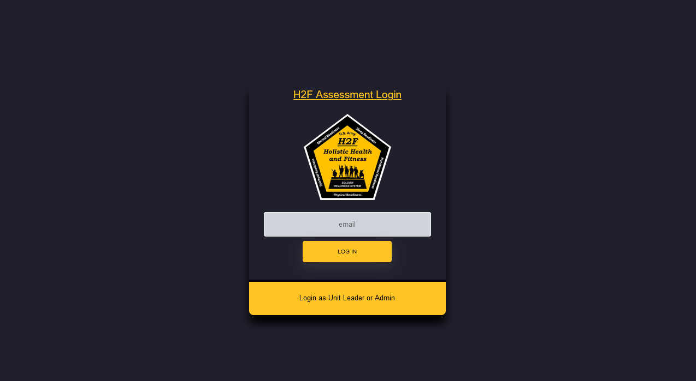

# Holistic Health Assessment Application (H2F)


## Azure Deployment Link
The application is deployed on Microsoft Azure at the following link: 
- https://h2f-app-v2.azurewebsites.net/

Note by agreement between the Project Sponsor and H2F Team members, the Deployment link will only be active up until December 29th 2023 and the app may take a moment to load up intially.

---

---

## Project Members
**Sponsor:** 
-  `CPT Brian Harder`

**Faculty Mentor:**
- `Dr. Subu Kandaswamy`

**H2F Members:**  
- `AbdulAziz Al-Dalaan`
- `Brendan Nelson`
- `Aaron Straka` 

---
## Table of Contents
- [Description and Overview](#description-and-overview)
- [Required Software Installation](#required-software-installation)
    - [Prerequisites](#prerequisites)
    - [Software Installation Guides](#software-installation-guides)
        - [For Windows and Mac OS Users](#for-windows-and-mac-os-users)
            - [NodeJS](#nodejs)
            - [MySQL and MySQL Workbench](#mysql-and-mysql-workbench)
        - [For (Ubuntu) Linux Users](#for-ubuntu-linux-users)
            - [NodeJS using Node Version Manager (nvm)](#nodejs-using-node-version-manager-nvm)
            - [MySQL and MySQL Workbench](#mysql-and-mysql-workbench-1)
        - [Troubleshooting](#troubleshooting)
            - [NodeJS](#nodejs-1)
            - [MySQL](#mysql-1)
- [Application Setup](#application-setup)
    - [Database Setup with Dump File in MySQL CLI](#database-setup-with-dump-file-in-mysql-cli)
    - [NodeJS Application Startup](#nodejs-application-startup)
- [Application testing](#application-testing)
- [Utilitzing the Application](#utilitzing-the-application)
    - [General Application Notes](#general-application-notes)
    - [Blank Users](#blank-users)
    - [Unit Leaders](#unit-leaders)
    - [Admin Users](#admin-users)
- [Additional Resources](#additional-resources)

## Description and Overview
Our sponsor, CPT Brian Harder of the Virginia Army National Guard, is charged with the administration of the Holistic Health and Fitness (H2F) Screening Assessment across Virginia. This comprehensive assessment is vital in ensuring that all soldiers maintain prime mental and physical health, providing them with tailored feedback to meet their diverse needs.

In our endeavor to aid CPT Harder and his staff, our team has crafted a web application that simplifies the entire process. The app facilitates the efficient assessment and tracking of soldiers' results on the Holistic Health and Fitness Screening Assessment. It enables soldiers to easily complete the assessment online, thus allowing CPT Harder's team to perform in-depth data analytics to pinpoint and assist those in need.

Leveraging the robustness of NodeJS and the reliability of MySQL databases, our technology stack is designed to consolidate assessment data into a single repository. Our goal is to empower our sponsor and his team to analyze the results effectively, gauge the wellness of soldiers in different units, and provide necessary aid wherever it's needed.

This application allows all soldiers to complete the assessment online and by default the application is loaded with the 3 main core assessments which are the Knowledge Check, Cognitive Performance, and Movement Screening. It also has higher privileges user types such as Unit Leaders and Administrators that can view the results of their unit and the entire state respectively. Administrators can also add, edit, and delete assessments. 

## Required Software Installation

### Prerequisites

NodeJS is a JavaScript runtime environment that executes JavaScript code outside of a browser. It is required to run the application. Our application was built with NodeJS version 20.5.1 hence we recommend the same or a newer version. You will also need to utilize the Node Package Manager (npm) to install the application's dependencies, however, this is included with NodeJS.

- [NodeJS](https://nodejs.org/en/)

MySQL is an open-source relational database management system. It is required to store the application's data. Our application was built with MySQL version 8.0.35 hence we recommend the same or a newer version.

- [MySQL](https://www.mysql.com/)

MySQL Workbench **(Optional)** is a visual database design tool that integrates SQL development, administration, database design, creation, and maintenance into a single integrated development environment (IDE). It is required to create the database and tables for the application. This is optional as you can also use the MySQL CLI to create the database and tables, however, we recommend using MySQL Workbench as it is more user friendly.

- [MySQL Workbench](https://www.mysql.com/products/workbench/)

---

### Software Installation Guides

In regards to the installation of NodeJS and MySQL, we highly recommend following the installation guides provided below to start. These guides will walk you through the installation process step-by-step for each respective operating system.

---
### For Windows and Mac OS Users

#### NodeJS

1. Navigate to the [NodeJS Download Page](https://nodejs.org/en/download/) and download the appropriate installer for your operating system.
2. Run the installer and follow the provided installation guide here [NodeJS Installation Guide](https://radixweb.com/blog/installing-npm-and-nodejs-on-windows-and-mac).
3. Verify that NodeJS was installed correctly by opening a Windows Powershell instance or the terminal on Mac and run `node -v` or `node --version`. You should see the version number of NodeJS printed to the terminal.

The same guide provided in step 2 also goes through details on how to change to the latest version of NodeJS if you already have it installed using nvm.

#### MySQL and MySQL Workbench

1. Navigate to the [MySQL Download Page](https://dev.mysql.com/downloads/installer/) and download the appropriate installer for your operating system.
2. Run the installer and follow the provided installation guide here [MySQL Installation Guide for Windows](https://www.freecodecamp.org/news/how-to-install-mysql-workbench-on-windows/) or [MySQL Installation Guide for Mac](https://www.youtube.com/watch?v=-wpzS5NcYT8).
3. Verify that MySQL was installed correctly by opening a terminal and running `mysql -V`. You should see the version number of MySQL printed to the terminal.

**IMPORTANT**: Make sure to remember the `root password` you set for the `root user` during the installation process. You will need it later to setup the database.

---
### For (Ubuntu) Linux Users

#### NodeJS using Node Version Manager (nvm)
1. Open a terminal and run `curl -o- https://raw.githubusercontent.com/nvm-sh/nvm/v0.39.7/install.sh | bash` to install nvm.
2. The installation process from step 1 should also automatically add the nvm configuration to your profile. If you're using zsh, that would be `~/.zshrc`. If you're using bash, that would be `~/.bash_profile` ...or some other profile. If it doesn't automatically add nvm configuration, you can add it yourself to your profile file: 
```
export NVM_DIR="$([ -z "${XDG_CONFIG_HOME-}" ] && printf %s "${HOME}/.nvm" || printf %s "${XDG_CONFIG_HOME}/nvm")"
[ -s "$NVM_DIR/nvm.sh" ] && \. "$NVM_DIR/nvm.sh" # This loads nvm
```
3. Verify that nvm was installed correctly by opening a terminal and running `nvm --version`. You should see the version number of nvm printed to the terminal.
4. run `nvm install node` to install the latest version of NodeJS with npm.

#### MySQL and MySQL Workbench
1. Open a terminal and update the package index by running `sudo apt update`.
2. Following the installation guide for Linux here [MySQL Installation Guide for Linux](https://linuxhint.com/installing_mysql_workbench_ubuntu/).
3. Verify that MySQL was installed correctly by opening a terminal and running `mysql -V`. You should see the version number of MySQL printed to the terminal.

**IMPORTANT**: Make sure to remember the `root password` you set for the `root user` during the installation process. You will need it later to setup the database.

### Troubleshooting

### NodeJS

Generally, it is recommend to install NodeJS along with NPM via NVM on all OSs. Hence if you have issues on Windows or Mac OS, you can try to install NodeJS via NVM. This guide will walk you through the process: [NodeJS Installation Guide via NVM on All OSs](https://www.freecodecamp.org/news/node-version-manager-nvm-install-guide/).

### MySQL

If you have issues installing MySQL on Windows, you can try to install MySQL via Chocolatey. This guide will walk you through the process: [MySQL Installation Guide via Chocolatey on Windows](https://gist.github.com/naveen521kk/fea2dc21e09933795bc71b9add4676c6).

## Application Setup

Now we are ready to start the application. There are for our case we will be first setting up our database locally on our machine via loading data from our dump file, and then we will be starting the application via Github Clone or Zip Package.

### Database Setup with Dump File in MySQL CLI

We recommend using MySQL Workbench to setup the database and tables for the application as it is more user friendly It is also really good for querying data rather than performing it within the MySQL CLI. However, if you prefer to use the MySQL CLI, you can follow the steps below to setup the database and tables for the application. We will be showing the CLI method as it is far more convenient and it is the same for all OSs. 

1. Make sure you are in the project directory `H2FSAT_APP` (if project was zipped then `H2FSAT_APP-main`) in vscode or your preferred IDE.
2. Open a terminal and run `mysql -u root -p` to login to MySQL CLI. You will be prompted to enter the `root password` you set during the installation process.
3. Once you are logged in, run `CREATE DATABASE h2f_database;` to create the database. Note that the database name is `h2f_database` and it is case sensitive.
4. exit the MySQL CLI by running `exit;`.
5. Now we will load the data from the dump file `h2f_dump.sql` into the database we just created. Run `mysql -u root -p h2f_database < h2f_dump.sql` to load the data from the dump file into the database. You will be prompted to enter the `root password` you set during the installation process.
6. Now we will verify that the data was loaded correctly. Run `mysql -u root -p` to login to MySQL CLI. You will be prompted to enter the `root password` you set during the installation process.
7. Once you are logged in, run `USE h2f_database;` to use the database.
8. Run `SHOW TABLES;` to verify that the tables were created correctly. You should see the following tables printed to the terminal:
```
+------------------------+
| Tables_in_h2f_database |
+------------------------+
| Core_Results           |
| Notifications          |
| Survey_As              |
| Survey_Ds              |
| Survey_Infos           |
| Survey_Qs              |
| Survey_Rs              |
| Survey_Vs              |
| Units                  |
| Users                  |
+------------------------+
```
9. exit the MySQL CLI by running `exit;`.
10. Now in the project directory `H2FSAT_APP` (if project was zipped then `H2FSAT_APP-main`), open the file `db.js` in vscode or your preferred IDE which with look something like the following.
```
const { Sequelize } = require('sequelize');

const sequelize = new Sequelize('h2f_database', 'root', 'Password123#@!', {
    host: 'localhost',
    dialect: 'mysql',
    define: {
        timestamps: false
    }
})

module.exports = sequelize;
```
11. Next you will need to change the field which shows `Password123#@!` to be the `root password` you set during the installation process as this is needed for the application to access your database.

### NodeJS Application Startup

1. Make sure you perform the [Database Setup with Dump File in MySQL CLI](#database-setup-with-dump-file-in-mysql-cli) in MySQL CLI or MySQL Workbench before proceeding.
2. Make sure you are in the project directory `H2FSAT_APP` (if project was zipped then `H2FSAT_APP-main`) in vscode or your preferred IDE.
3. Open a terminal and run `npm install` to install the application's dependencies.
4. Once the dependencies are installed, run `npm start` or `nodemon` to start the application.
5. Check that the `Setup completed` message is printed to the terminal. Which is a sign that the application is running correctly.
7. Open a browser and navigate to `http://localhost:3000/` to access the application.
8. If you loaded up to a login page, which looks like the image below, then the application is running correctly.



## Application testing

In order to run our application tests, after installing the application's dependencies from [NodeJS Application Startup](#nodejs-application-startup), run `npm test` in the terminal. This will run all the tests we have created for the application which covers all major features within the application.

**IMPORTANT**: The tests cases may not work on all machines as the tests are dependent on dependant on the OS as well as other possible external dependencies such as browsers. As such, we verified that the tests successfully pass on Windows 10/11 when using the Chrome browser, and tests are different OSs and browsers may not work.

## Utilitzing the Application

This section will walk through the basics of utilizing the application mainly in terms of how the 4 main different user types can utilize the application and how they differ.

### General Application Notes

1. The users are split into 3 different user types which are Blank, Unit Leaders, and Admin Users. 
2. All unit leaders and admin users are required to provide a password which is "1234" for all respective users' emails.
3. The 3 core assessments; Knowledge Check, Cognitive Performance, and Movement Screening cannot be deleted from the application as they are core assessments within the application which must be present at all times. However all other assessments which Admins create can be deleted.
4. The only editable core assessment is the Knowledge Check, and any other which is created can be edited by Admins
5. All Blank users will start with only their email and you will have to enter any valid state, unit, rank, DOB, and gender.
6. The only valid unit state combinations within the "Enter Profile Information" page for all Blank default users upon logging in for the first time are the following:
```
UIC: "1st" - State: "Virginia" 
UIC: "2nd" - State: "North Carolina" 
UIC: "3rd" - State: "Pennsylvania" 
UIC: "4th" - State: "Virginia"
UIC: "5th" - State: "Virginia"
```
7. Unit 4th and Unit 5th contain no users besides their leaders by default as we expect these could be used as blank Units initially to fill up with the Blank Users listed below. 
8. Within the "Enter Profile Information" page, from logging in for the first time as the Blank User the DOB which is entered must be at least 17 years old as of the current date.

### Blank Users

These are the default users which are only loaded into the application by default with only storing their first name, last name, and email. These users are meant to be used as normal blank users to enter their profile information and take the assessments. Hence upon logging into the application with a valid army.mil email address, you will be prompted to enter your profile information. Once you enter your profile information, you will be able to login again to then take the assessments. 

- Must enter their profile information upon logging in for the first time.
- Have the ability to take assessments.

```
ALL BLANK USER EMAILS

jack.reacher@army.mil
alice.johnson@army.mil
bob.smith@army.mil
charlie.brown@army.mil
david.williams@army.mil
emily.davis@army.mil
frank.miller@army.mil
grace.wilson@army.mil
harry.moore@army.mil
ivy.taylor@army.mil
jack.anderson@army.mil
kathy.thomas@army.mil
larry.jackson@army.mil
molly.white@army.mil
nathan.harris@army.mil
olivia.martin@army.mil
paul.thompson@army.mil
quincy.garcia@army.mil
rachel.martinez@army.mil
finn.wolf@army.mil
sam.robinson@army.mil
tina.clark@army.mil
uma.rodriguez@army.mil
victor.lewis@army.mil
wendy.walker@army.mil
xavier.hall@army.mil
yvonne.allen@army.mil
zach.young@army.mil
amy.king@army.mil
brian.wright@army.mil
catherine.lee@army.mil
daniel.gonzalez@army.mil
eva.perez@army.mil
fred.hernandez@army.mil
gina.lopez@army.mil
hank.hill@army.mil
irene.baker@army.mil
jake.rivera@army.mil
kelly.campbell@army.mil
liam.mitchell@army.mil
mona.carter@army.mil
ned.roberts@army.mil
oscar.turner@army.mil
pam.phillips@army.mil
quentin.evans@army.mil
```

### Unit Leaders

Same as the Blank Users, but with the additional privilage to view the results of any assessment for their respective unit, edit the notifications of the 3 main core assessments, upload existing assessment data, and delete the result of any user from their unit. 

- Must login with password which is “1234”
- Have the ability to take all assessments
- Can view the results of all users from their own unit
- Delete results of users from their unit
- Can upload existing excel data to application
- Edit notification flags for their own Unit for the Knowledge Check, Cognitive Performance, and Movement Screening

```
UNIT LEADER EMAILS

jane.doe@army.mil      -  LEADER OF UNIT 1st  
amy.wilson@army.mil    -  LEADER OF UNIT 2nd
andrew.wu@army.mil     -  LEADER OF UNIT 3rd
john.smith@army.mil    -  LEADER OF UNIT 4th
john.doe@army.mil      -  LEADER OF UNIT 5th
```

### Admin Users

Same as Unit Leaders, with the ability to view the results of assessments of all users from all units across the nation, whilst also being able to edit the core assessment notifications from all units in their respective state, and also can create, edit, and delete assessments entirely.

- Must login with password which is “1234”
- Have the ability to take all assessments
- Can view the results of all users from All units
- Delete results of users from All unit
- Can upload existing excel data to application
- Edit notification flags for All unit from their respective state for the Knowledge Check, Cognitive Performance, and Movement Screening 
- Can create, edit and delete assessments (3 core assessments cannot be deleted)
- Can edit the HHA Knowledge Check only (Movement Screening, and Cognitive Performance Assessments cannot be edited)

```
ADMINS EMAILS

brian.adams@army.mil    -  VA ADMIN
jake.johnson@army.mil   -  NC ADMIN
danny.dans@army.mil     -  PA ADMIN
percy.jackson@army.mil  -  VA ADMIN
mark.zackary@army.mil   -  TX ADMIN
```

**IMPORTANT**: All other user's emails which you may see present within the application are only used for data populating purposes, all these emails are Blank Users whose profile information is already filled out and has already taken all the 3 main core assessments.

## Additional Resources

For more information on the application and how to utilize all features within it for all user types you can refer to the Application's User Manual here along with the Application's Project Report:

[H2F APP Documentation](https://drive.google.com/drive/folders/19xZWfl32MNuR2JBonhYf7eOo1e2ICBR9?usp=sharing)
